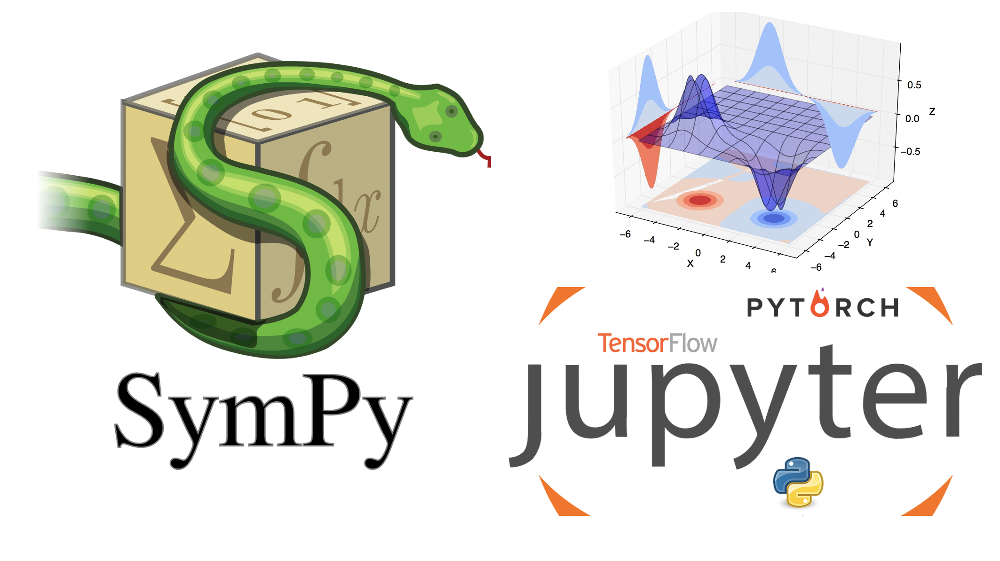

 # CURSO-TALLER: Introducción al análisis y visualización de datos en Python

## Fechas y horarios
#### Fechas: 31 de agosto - 04 de septiembre de 2020
#### Horario: 09:00 a 13:00 horas.
## Página del curso
[www.hpclab.unam.mx/course/python](http://www.hpclab.unam.mx/course/python)

## Prerequisitos
<ol><li>Python versión 3.x instalado</li><li>Entorno de desarrollo integrado (cualquiera de los siguientes)<ul><li>Jupyter - https://jupyter.org/</li><li>Pycharm -https://www.jetbrains.com/es-es/pycharm/</li><li>Spyder- https://www.spyder-ide.org/</li></ul></li> <li>Librerías <ul><li>Numpy</li>Pandas<li>Matplotlib</li><li>Scipy</li><li>PyTorch (Opcional)</li></ul></li></ol>

[Ver video de instalación de prerequisitos](https://www.youtube.com/watch?v=1ETiwXo0lg4&feature=emb_title)

## Impartido por:
<ul>
  <li> Dr. Ulises Olivares Pinto</li>
  <li> Walter André Rosales Reyes</li>
</ul>

## Temario, materiales y videos

| Día        | Tema           | Contenido  |  Material   | Videos |
| :-------------: |:-------------:|:-----| :-----:|:-----: |
| Día 0       | Instalación de Prerrequisitos | <ul>Instalación de:<ul><li>Python</li><li>Jupyter</li><li>Librerías</li><ul></ul> | [Ver página](http://132.247.186.49/courses/python/) | [Video Instalación](https://www.youtube.com/watch?v=1ETiwXo0lg4&feature=emb_title)|
| Día 1      | Introducción al lenguaje Python| <ul> <li> Introducción y antecedentes</li> <li> Entorno de programación</li> <li> Variables y tipos</li> <li>Operadores</li> <li>Instrucciones de control</li> <li>Funciones</li> <li>Librerías</li>  </ul>|  <ol><li> [Presentación](pdf/dia1.pdf)</li> <li>[Código(Colab)](code/día1.ipynb)</li><li>[Proyecto Final](code/Solved/Day1)</li></ol> | [Video Día 1](https://youtu.be/DpYoRBKDXts)|
| Día 2      |  Almacenamiento de datos | <ul> <li> Listas </li>   <li> Diccionarios </li> <li> Numpy <ul><li>Arreglos</li><li>Matrices</li><li>Subconjuntos</li><li>Operaciones Básicas</li></ul> </ul> |  <ol><li>[Presentación](pdf/dia2.pdf)</li> <li>[Código(Colab)](code/día2.ipynb)</li> <li>[Proyecto Final](code/Solved/Day2)</li> </ol>| [Video Día 2](https://youtu.be/gQL5qNcYkc0)|
| Día 3      | Manipulación de datos | <ul> <li> Importación de datos CSV, TXT </li> <li> Pandas (o	DataFrames, ordenamientos, subconjuntos de filas y columnas, Unión de DataFrames)</li> <li>Estadísticos básicos </li></ul>  |  <ol><li>[Presentación](pdf/dia3.pdf)</li> <li>[Código(Colab)](code/día3.ipynb)</li><li>[Salaries.csv](data/salaries.csv)</li><li>[Flights.csv](data/flights.csv)</li> <li>[Proyecto Final](code/Solved/Day3)</li> </ol>  | [Video Día 3](https://youtu.be/_uobzsoGYYs)|
| Día 4      | Matemáticas simbólicas y visualización de datos| <ul>  <li> Manipulaciones algebraicas</li> <li> Cálculo (Expansión de series, diferenciación, integración) </li> <li> Resolución de ecuaciones algebraicas</li> <li> ¿Cómo elegir un gráfico adecuado? </li> <li> Matplotlib (o	Gráficos simples y personalización de gráficos)</li></ul>| <ol><li>[Presentación](pdf/dia4.pdf)</li> <li>[Código(Colab)](code/día4.ipynb)</li> <li>[mpg.csv](data/mpg.csv)</li> <li>[temp.csv](data/temp.csv)</li> <li>[iris.csv](data/iris.csv)</li> <li>[co2.csv](data/co2.csv)</li> <li>[Proyecto Final](code/Solved/Day4)</li> </ol>| [Video Día 4](https://youtu.be/tfWXAWlpSSM)|
| Día 5      | Python e inteligencia artificial | <ul> <li> Introducción y definiciones</li> <li> Redes neuronales</li> <li> Deep Learning con PyTorch</li></ul> |  <ol><li>[Presentación](pdf/dia5.pdf)</li> <li>[Código(Colab)](https://colab.research.google.com/drive/1Oua75Lkw-frEwPcweGYXUedw-4t5aozy?usp=sharing)</li><li>[Código(GitHub)](code/día5.ipynb)</li><li>[Código(Kaggle)](https://www.kaggle.com/walt22r/proyectointeligenciasanitaria?select=COVID19MEXICO.csv)</li> <li>[Proyecto Final](code/Solved/Day5)</li> </ol>   |[Video Día 5](https://youtu.be/87ZakDX4Ajs) |

##### Última modificación 20 de septiembre de 2020
